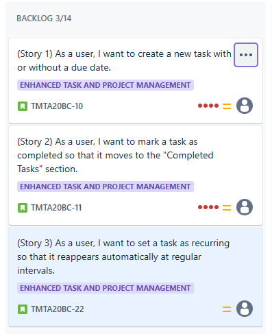
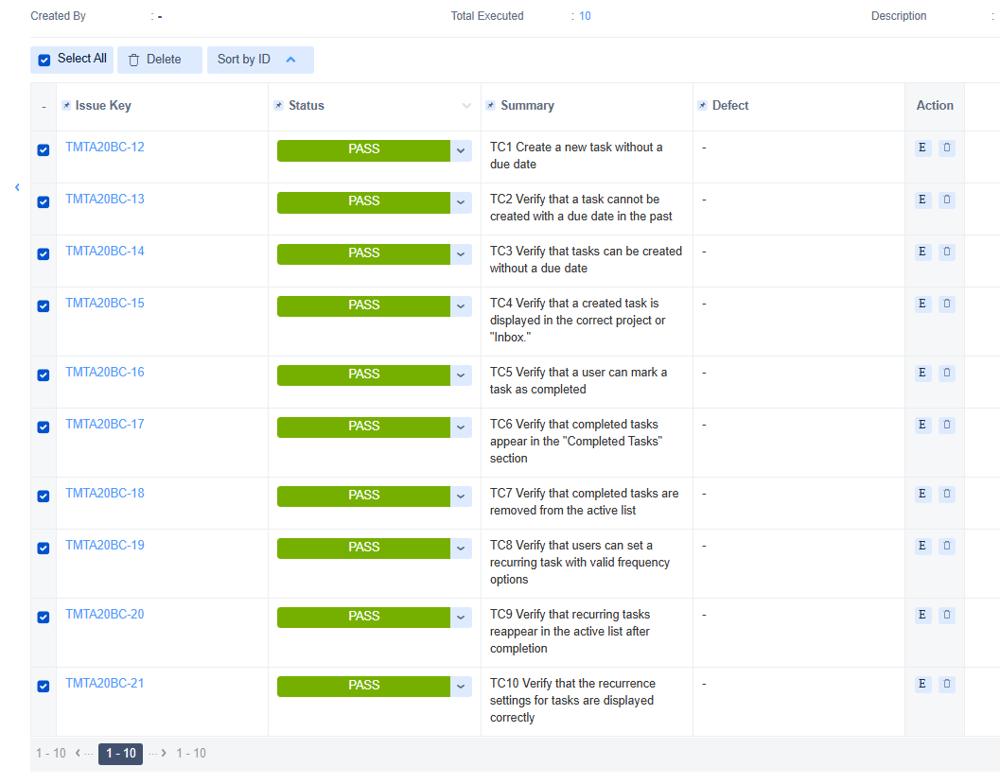

<h1>Testing Project for **Todoist**</h1>

The scope of the final project for ITF Manual Testing Course is to use all gained knowledge throught the course and apply them in practice, using a live application

Application under test: (https://todoist.com/)

Tools used: Jira, Zephyr Squad.

<h2>Functional specifications:</h2>

The following stories were created in Jira to describe the functional specifications of the Todoist testing project:

Story 1: Create a New Task

Title: As a user, I want to create a new task with or without a due date.
Description: Users should be able to create a task by entering a title, optionally adding a due date, and saving it.

Story 2: Mark a Task as Completed

Title: As a user, I want to mark a task as completed so that it moves to the "Completed Tasks" section.
Description: Users should be able to mark tasks as completed, removing them from the active list and moving them to "Completed Tasks."

Story 3: Set Recurring Tasks

Title: As a user, I want to set a task as recurring so that it reappears automatically at regular intervals.
Description: Users should be able to create a recurring task by setting its frequency (e.g., daily, weekly).

Here you can find the release that was created for this project:

<h2>Testing process</h2>

The test process was performed based on the standard test process as described below.

<h3>1.1 Test planning</h3>

The Test Plan is designed to describe all details of testing for all the modules from the JPetStore Demo application.

The plan identifies the items to be tested, the features to be tested, the types of testing to be performed, the personnel responsible for testing, the resources and schedule required to complete testing, and the risks associated with the plan. The test plan that was created for this project can be found here (https://itfclasses.atlassian.net/jira/software/c/projects/TMTA20BC/boards/319)

<h4>1.1.1. Roles asigned to the project and persons allocated</h4>

<ul>
  <li>Project manager: John Smith</li> 
  <li>Product owner: Jane Doe</li>
  <li>Software developer: Mike Johnson</li>
  <li>QA Engineer: Cimpoca Bogdan</li>
</ul>

<h4> 1.1.2 Entry criteria defined </h4>

<li>-Stories were reviewed and approved.</li> 
<li>-Test environments were configured.</li> 
<li>-Necessary test data was prepared.</li> 

<h4> 1.1.3 Exit criteria defined </h4>

<li>-All planned test cases executed.</li> 
<li>-All critical bugs fixed and verified.</li> 
<li>-Test coverage of at least 90% achieved.</li> 

<h4> 1.1.4 Test scope</h4>

<h5> Tests in scope: </h5>

<li>Functional testing for task creation, completion, and recurrence.e</h4>
<li>UI testing on desktop and mobile browsers</h4>

<h5>Tests not in scope: </h5>

<li>Performance testing.</h4>
<li>Testing integrations with third-party apps.</h4>

<h4>1.1.5 Risks detected</h4>

<h5>Project risks:</h5>

Limited time for regression testing if bugs are detected late.

<h5> Product risks: </h5>

High-severity bugs in recurring tasks may affect task scheduling accuracy.

<h4>1.1.6 Evaluating entry criteria</h4>

The entry criteria defined in the Test Planning phase have been achieved and the test process can continue.

<h3>1.2 Test Monitoring and Control<h3>

Reason for Monitoring and Control:
The test monitoring and control phase was conducted to ensure that the testing activities were progressing according to the planned timeline and that the quality objectives were being met. This phase also helped to identify any deviations from the test plan, manage risks, and ensure the effective resolution of any challenges encountered during testing.

<h3> 1.3 Test Analysis </h3>
The testing process will be executed based on the application requirements. <b>(The requirements analysis has been done in order to implement the <i>early testing</i> )</b>.   

The following test conditions were found:  

1. Verify that a user can create a task with a valid title and future due date.
2. Verify that a task cannot be created with a due date in the past.
3. Verify that tasks can be created without a due date.
4. Verify that a created task is displayed in the correct project or "Inbox."
5. Verify that a user can mark a task as completed.
6. Verify that completed tasks appear in the "Completed Tasks" section.
7. Verify that completed tasks are removed from the active list.
8. Verify that users can set a recurring task with valid frequency options.
9. Verify that recurring tasks reappear in the active list after completion.
10. Verify that the recurrence settings for tasks are displayed correctly.

<h3>1.4 Test Design</h3>

Functional test cases were created in Zephyr Squad based on the analysis of the specifications. The test cases can be accessed here **(inserati linkul catre fisierul cu testele, in format pdf, word sau csv)**

<h3>1.5 Test Implementation</h3>

The following elements are needed to be ready before the test execution phase begins

<h3>1.6. Test Execution </h3>

Test cases are executed on the created test Cycle summar

No bugs were identified during this cycle, as all test cases were executed successfully with a Pass status.

Since no failed tests or bugs were identified, there are no bug reports to address or prioritize. The system's functionalities (task creation, task completion, and recurring tasks) performed as expected and aligned with the requirements.

Full regression testing is needed on the impacted areas after the bugs are fixed and retesting will be done for every functionality that was previously failed.

<h3> 1.7 Test Completion</h3>
As the Exit criteria were met and satisfied as mentioned in the appropriate section, this feature is suggested to ‘Go Live’ by the Testing team

Test Execution Chart:
The test execution chart generated from Jira dashboards is displayed below:

Final Results:

Total Number of Test Cases Created: 10

Total Number of Test Cases Executed: 10

Pass: 10
Fail: 0
Blocked: 0
Total Bugs Found: 0

General Testing Conclusion:

<li>1. Coverage: 100% of the in-scope requirements were validated, with no functionalities left untested.</li> 
<li>2. Bugs: No bugs were identified during testing, indicating a high level of stability and alignment with the requirements.</li> 
<li>3. Risk Assessment: No risks were identified that could impact the release. However, continuous monitoring is recommended post-launch to ensure performance under real-world conditions.</li> 
<li>4. Recommendations:</li> 
 <li>- Proceed with the launch as planned.</li> 
 <li> - Schedule a post-launch review to gather user feedback and address any unforeseen issues.</li> 
 <li> -Continue exploratory testing for potential edge cases in future releases.</li> 
 
  Lessons Learned:
    <li>- Early involvement of the testing team in defining requirements ensures better alignment between test scenarios and product functionality.</li> 
    <li>- Regular updates and communication within the team helped maintain an efficient and smooth testing process.</li> 
   <li> - A well-documented test cycle in Jira ensures traceability and accountability for future projects.</li> 
   
The product is ready for production, with a stable build and no critical issues identified during the testing phase.
